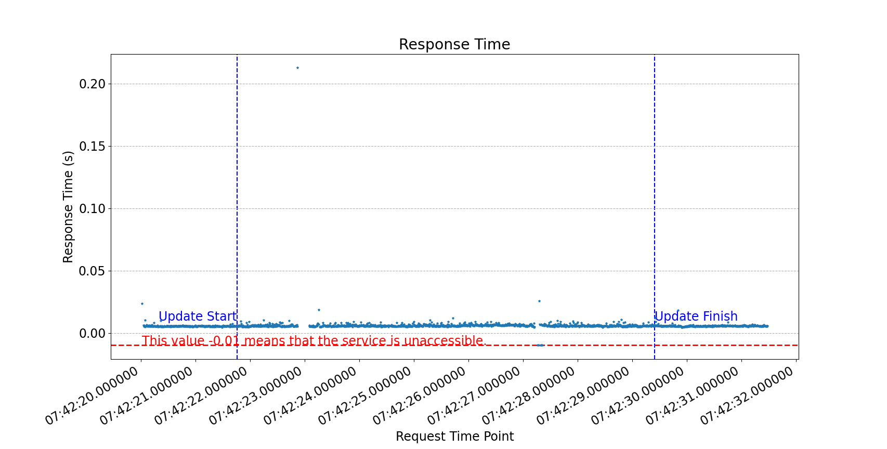
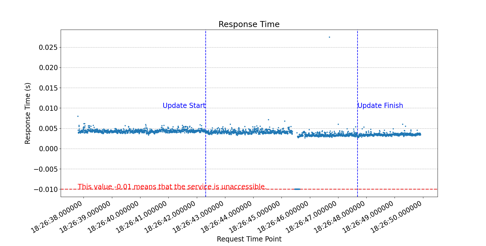
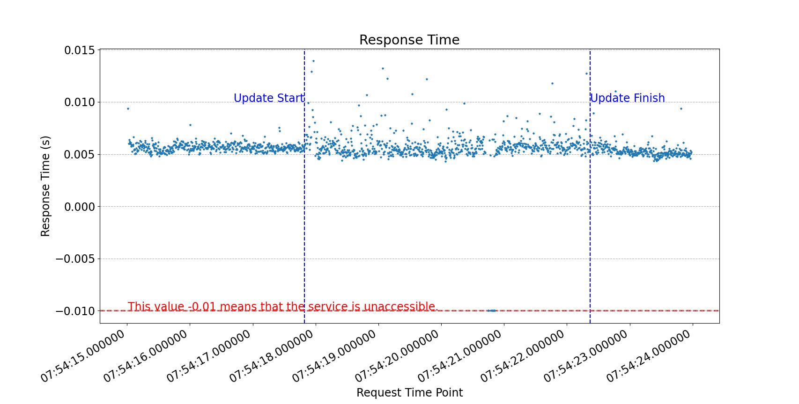
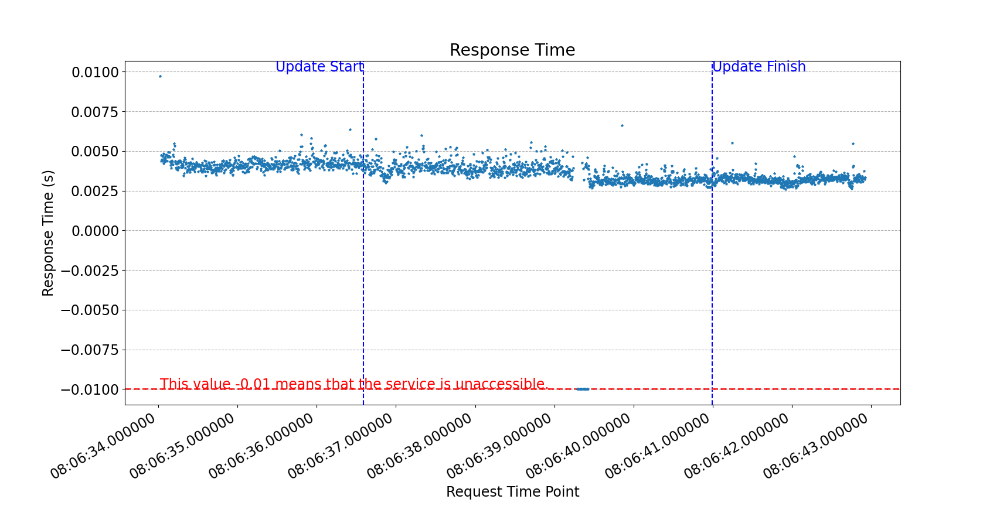
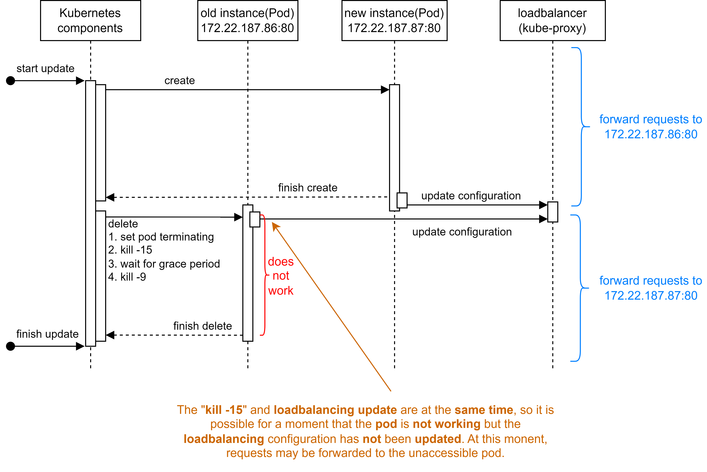
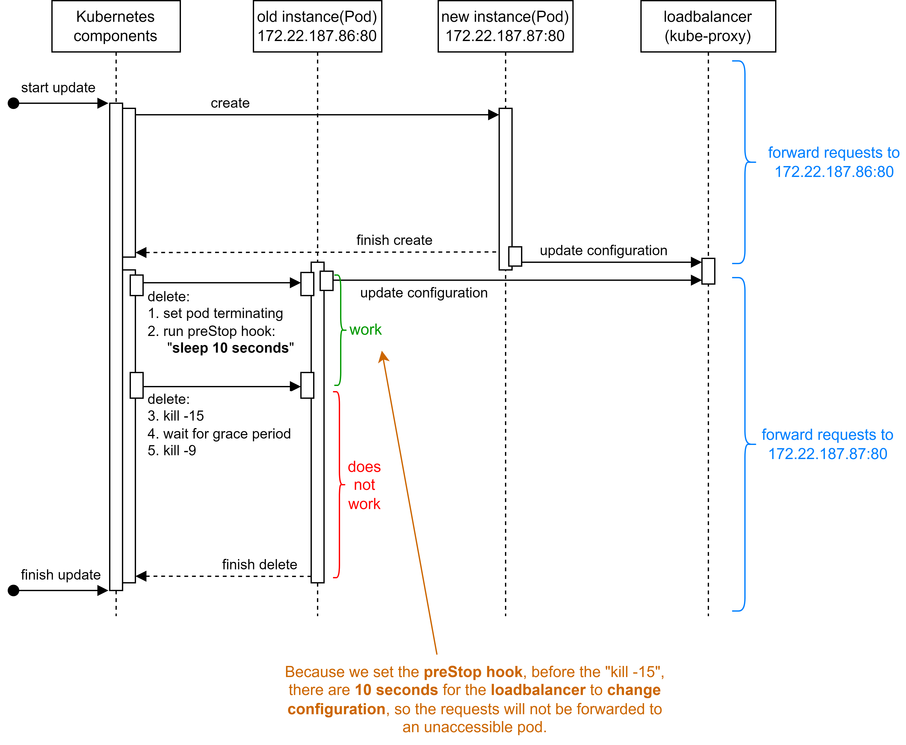
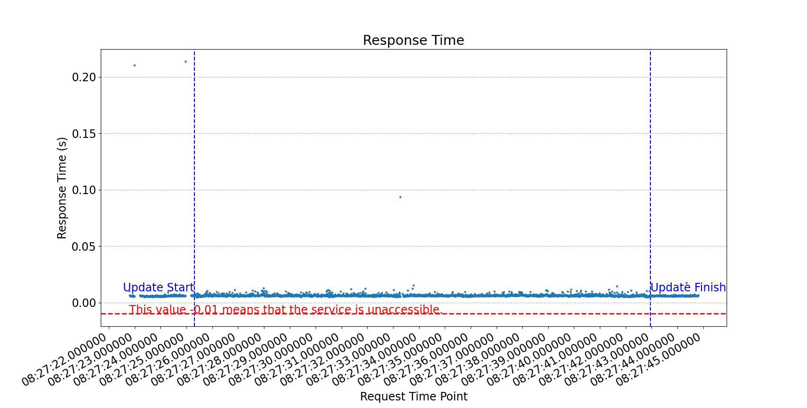
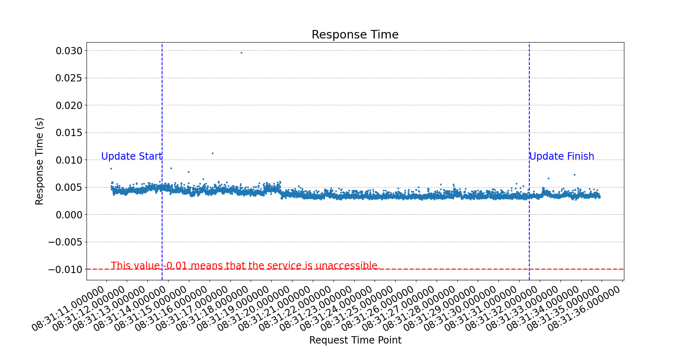
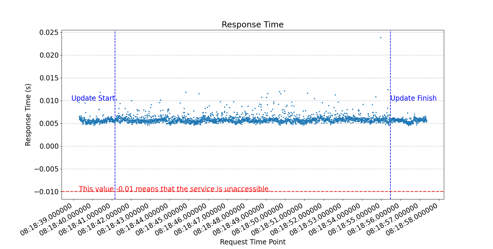
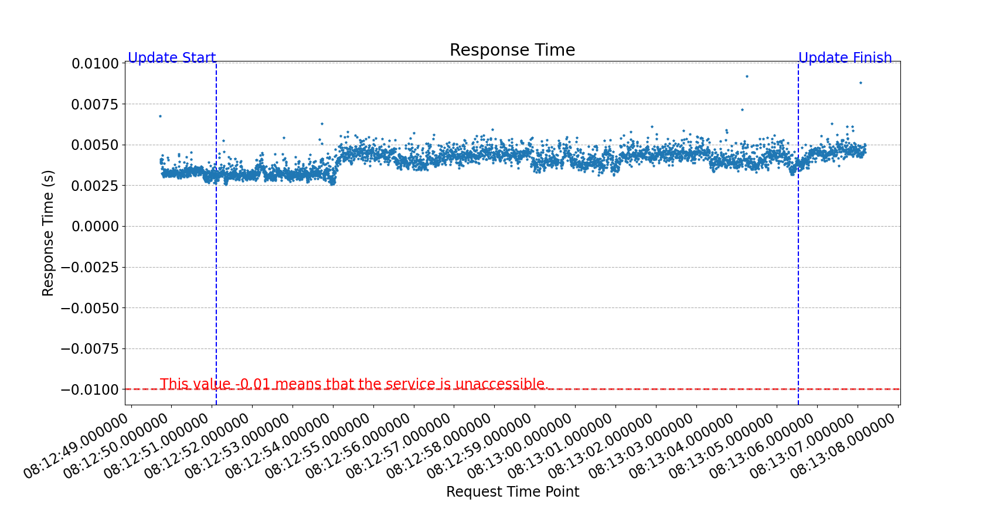

# Check the seamlessness/downtime of Kubernetes Rolling Update
> **When sharing or reusing, kindly acknowledge the source.**

This is an experiment to check whether Kubernetes Rolling Update is seamless (whether the service has downtime during update).

My Kubernetes version is `v1.26.3` with the git commit `9e644106593f3f4aa98f8a84b23db5fa378900bd`.

---
## How to use the programs in this project?
### An example to use `check.py`.
If I want to check the service url `http://192.168.100.31:30001` with the expected HTTP status code `200`, I should run `python3 -u check.py http://192.168.100.31:30001 200`. After collecting enough data, I can use `Ctrl+C` to stop this program and save data in to `check.csv`. The program will continuously check the service without interval until receiving "Ctrl+C". This program will record the response time as `-0.01 second` if the service is **not accessible**.

### An example to use `kubectl_rolling_update.py`.
If I want to triger the rolling update of a deployment named `deploy1` in namespace `ns1`, migrating its pod to a node named `node1`, I should run `python3 -u kubectl_rolling_update.py deploy1 ns1 node1`. This program will record the start time and end time of the rolling update, and save them into `update.csv`.

### An example to use `plotting.py`.
After generating the files `check.csv` and `update.csv` by `check.py` and `kubectl_rolling_update.py`, I can run `python3 -u plotting.py` to plot the figure to show the downtime of this service during a Kubernetes rolling update.


---
## The steps of my experiment.
1. I run a `Deployment` of `nginx:1.17.1` in Kubernetes with a `Service` and it only has `1` pod. The `maxUnavailable` is `0` and `maxSurge` is `1`. I also have `2` Kubernetes `Nodes`.
2. I use `check.py` to continually access the `Service` of this `Deployment`.
3. I use `kubectl_rolling_update.py` to trigger a `rolling update` by changing the `NodeName` to migrate the pod between `2` Kubernetes `Nodes`.
4. After the `rolling update`, I stop `check.py`.
5. I use `plotting.py` to plot the data in `check.csv` and `update.csv`.

## The scenarios in my experiment.
There are 4 scenarios in my experiment:
- The Deployment uses `Calico` as the container network, and `check.py` use `NodeIP:NodePort` to access the `Service`.
- The Deployment uses `Calico` as the container network, and `check.py` use `ClusterIP:ServicePort` to access the `Service`.
- The Deployment uses `HostNetwork` as the container network, and `check.py` use `NodeIP:NodePort` to access the `Service`.
- The Deployment uses `HostNetwork` as the container network, and `check.py` use `ClusterIP:ServicePort` to access the `Service`.

## Results without PreStop Hook

I will introduce the `PreStop` Hook later. At first, I did not set a `PreStop` Hook to the Deployment, and the results show that the `Rolling Update` is **not seamless** without a `PreStop` Hook.

The results are shown in the following 4 figures, in which each dot represents a request to the service. The `x` value of a dot is the the time point when it is sent out and the `y` value is the response time (duration) of this request. `check.py` will record the response time as `-0.01 second` if the service is **not accessible**.

From the figures, we can find that in any of the 4 scenarios, in the process of the `Rolling Update`, there is a moment, about `0.1 second`, during which time the request to the service may fail. 

**Therefore, we can conclude that the `Rolling Update` without `PreStop` Hook is not seamless and services have downtime during the update.**

#### Figure: Without PreStop, Calico, ClusterIP


#### Figure: Without PreStop, Calico, NodePort


#### Figure: Without PreStop, HostNetwork, ClusterIP


#### Figure: Without PreStop, HostNetwork, NodePort



## Analysis about the downtime during Rolling Update.

### Reason of the downtime
Our experiment is related to 5 Kubernetes components, i.e., kube-apiserver, kubelet, deployment-controller, endpointslice-controller, kube-proxy. In order to figure out the reason of the downtime during Rolling Update without PreStop Hook, I did some analysis and concluded the following steps of the Rolling Update:
1. When the Rolling Update starts, `deployment-controller` creates a `new pod`. 
2. After the `new pod` is created and runnning stably, `kube-proxy` updates the loadbalancing (iptables) rules to `add` the `new pod` as `a destination` of the service. At the same time, after the `new pod` is created and runnning stably, `deployment-controller` starts to delete the `old pod`. During the deletion of the `old pod`, `kube-apiserver` sets the pod as `terminating` at first, and then there are 2 parallel task sequences:
    * When finding that the `old pod` is `terminating`, `kubelet` will:
        1. send `"kill -15"` to the process inside the container of the `old pod`.
        2. wait for the `grace period`.
        3. send `"kill -9"` to the process inside the container of the `old pod`.
    * When finding that the `old pod` is `terminating`, `kube-proxy` will:
        1. update the loadbalancing (iptables) rules to `remove` the `old pod` from the `destinations` of the service.

The following is a sequence diagram to show the above steps. In the procedure, the 2 behaviors "`kubelet` sends `kill -15`" and "`kube-proxy` updates loadbalancing rules" are almost at the same time and there is not any restriction of their order, so it is possible that the process inside the `old pod` is killed before the `old pod` is removed from the loadbalancer, and in this condition some requests may be forwarded to the `old pod` but the `old pod` does not work, so some requests will fail. **This is the reason of the 0.1-second downtime in the Rolling Update without PreStop Hook.**




### Solution: Use PreStop Hook to eliminate the downtime.
If a pod has a `PreStop` Hook, when `kubelet` deletes this pod, it will execute the `PreStop` Hook before executing `kill -15`, so I add a `PreStop` Hook to the Deployment to eliminate the downtime during Rolling Update by postponing the `kill -15`. The following is my `PreStop` Hook:

```yaml
lifecycle:
  preStop:
    exec:
      command: ["/bin/sh", "-c", "sleep 10"]
```

After I add this `PreStop` Hook, the steps of the Rolling Update becomes:
1. When the Rolling Update starts, `deployment-controller` creates a `new pod`. 
2. After the `new pod` is created and runnning stably, `kube-proxy` updates the loadbalancing (iptables) rules to `add` the `new pod` as `a destination` of the service. At the same time, after the `new pod` is created and runnning stably, `deployment-controller` starts to delete the `old pod`. During the deletion of the `old pod`, `kube-apiserver` sets the pod as `terminating` at first, and then there are 2 parallel task sequences:
    * When finding that the `old pod` is `terminating`, `kubelet` will:
        1. **execute the `PreStop` Hook, which is `sleep 10 seconds`.**
        2. send `"kill -15"` to the process inside the container of the `old pod`.
        3. wait for the `grace period`.
        4. send `"kill -9"` to the process inside the container of the `old pod`.
    * When finding that the `old pod` is `terminating`, `kube-proxy` will:
        1. update the loadbalancing (iptables) rules to `remove` the `old pod` from the `destinations` of the service.

The following is a sequence diagram to show the above steps with `PreStop` Hook. The only difference is that `kubelet` waits for extra `10 seconds` before sending `"kill -15"`, but this `10 seconds` is enough for `kube-proxy` to remove the `old pod` from the loadbalancer, so this very simple `PreStop` Hook can (basically?) guarantee that after the process inside the `old pod` is killed, Kubernetes will not forward any requests to the `old pod`. Therefore, with this `PreStop` Hook the Rolling Update should be seamless. Then I do the experiment again to verify it.



## Results with PreStop Hook

The following 4 figures are the results of the experiment with `PreStop` Hook. We can find that all requests in this experiment succeeded, because `check.py` did not record `-0.01s` response time for any requests. 

**Therefore, we can conclude that the `Rolling Update` with `PreStop` Hook is seamless and services do not have any downtime during the update.**

#### Figure: With PreStop, Calico, ClusterIP


#### Figure: With PreStop, Calico, NodePort


#### Figure: With PreStop, HostNetwork, ClusterIP


#### Figure: With PreStop, HostNetwork, NodePort


---
## Conclusion
Kubernetes `Rolling Update` with `PreStop` Hook is seamless and services do not have any downtime during the update.